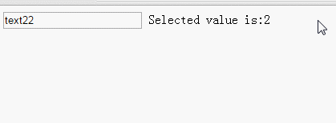

# vue-datalist

## Usage

html
```
<div id="demo">
    <datalist-component
        :options="valueAndText"
        :value-selected.sync="valueSelected">
    </datalist-component> 
    <span>Selected value is:</span>{{valueSelected}}                   
 </div>
<script src="../dist/vue-datalist.js"></script>
```
js
```
var MyDatalist = new VDatalist({
	component: 'datalist-component'
});

var valueSelected = 2;
var valueAndText = {
	1: "text11",
	2: "text22",
	3: "text33",
	4: "google",
	5: "dogs"
};

var ExpampleVue = new Vue({
	el: '#demo',
	data: {
		valueAndText: valueAndText,
		valueSelected: valueSelected
	}
});
```
then get



[example](http://dongss.github.io/vue-datalist/examples/example.html)
